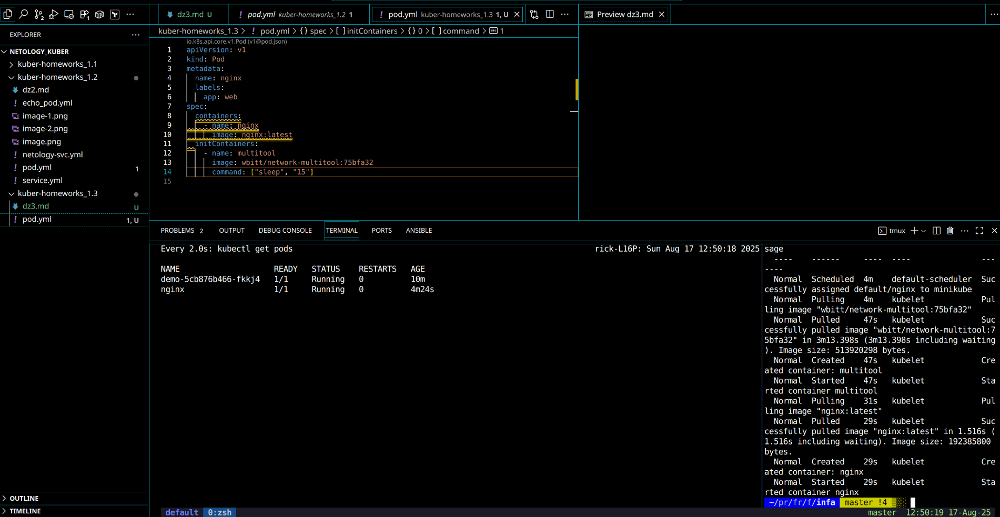
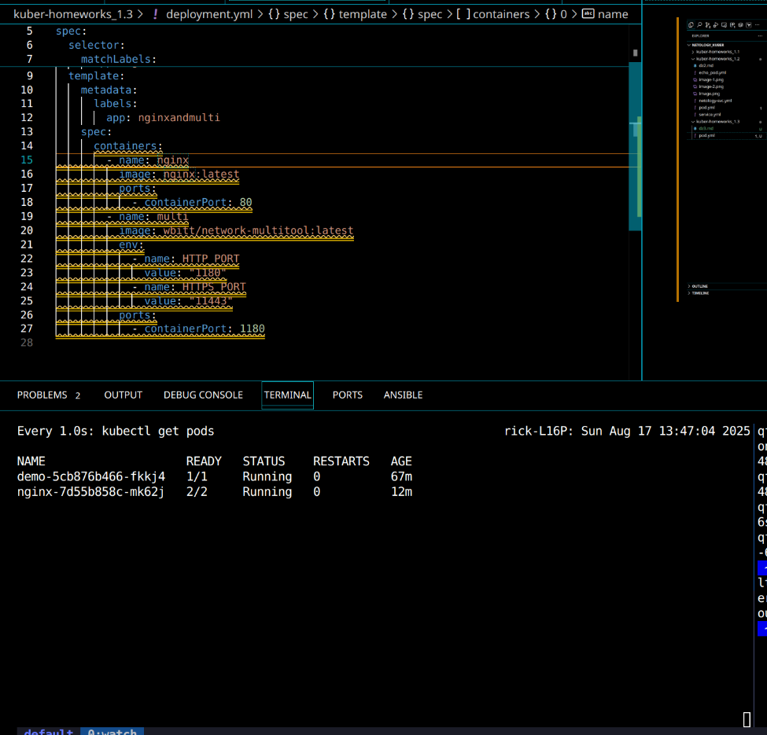
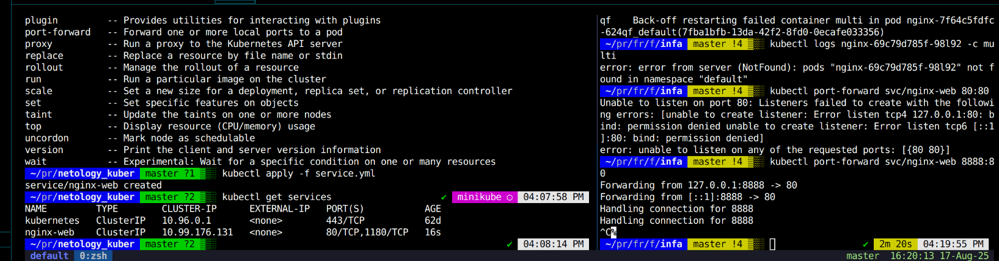
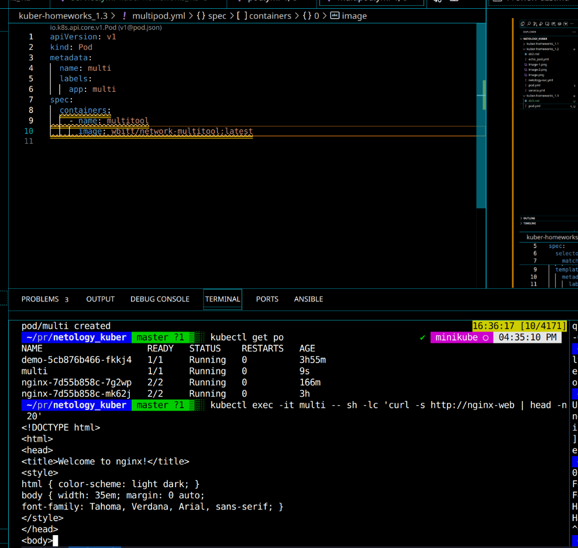
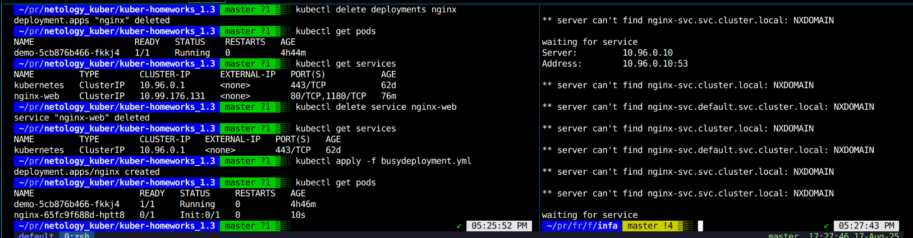
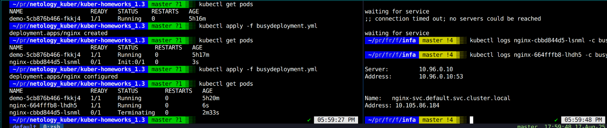

# 1

[multipod](multipod.yml)
[demployment](deployment.yml)
[service](service.yml)

# 2
Ждем создания сервиса

Сервис создан

[busydeployment.yml](busydeployment.yml)
[busyservice.yml](busyservice.yml)