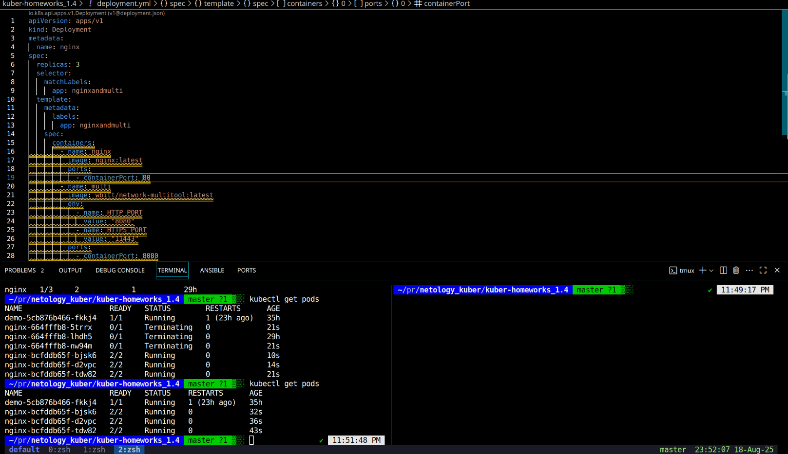
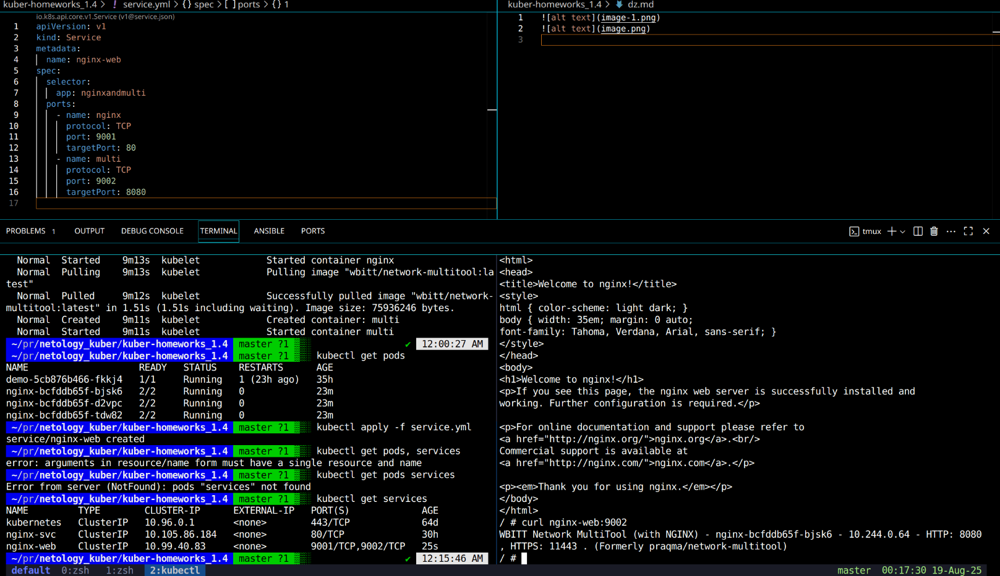
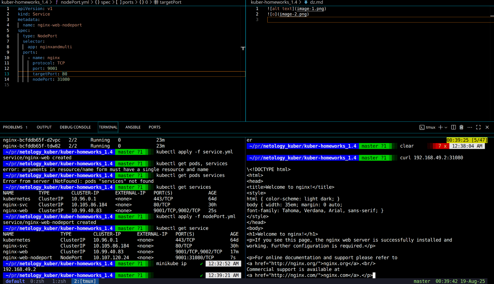
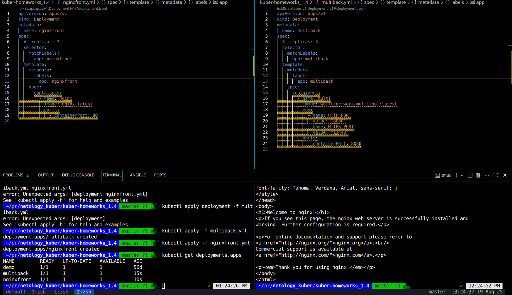
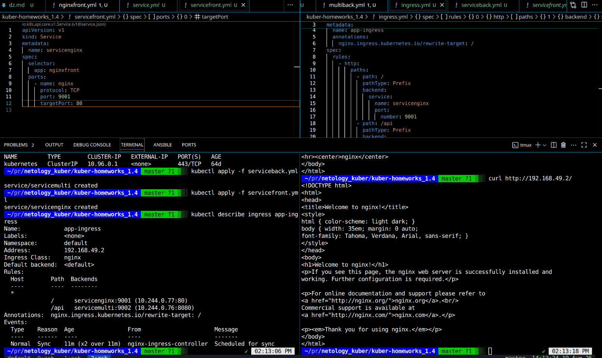

# 1

[deployment.yml](deployment.yml)
[nodePort.yml](nodePort.yml)
[service.yml](service.yml)

# 2

[multiback](multiback.yml)
[multifront](multifront.yml)
[serviceback](serviceback.yml)
[servicefront](servicefront.yml)
[ingress](ingress.yml)

