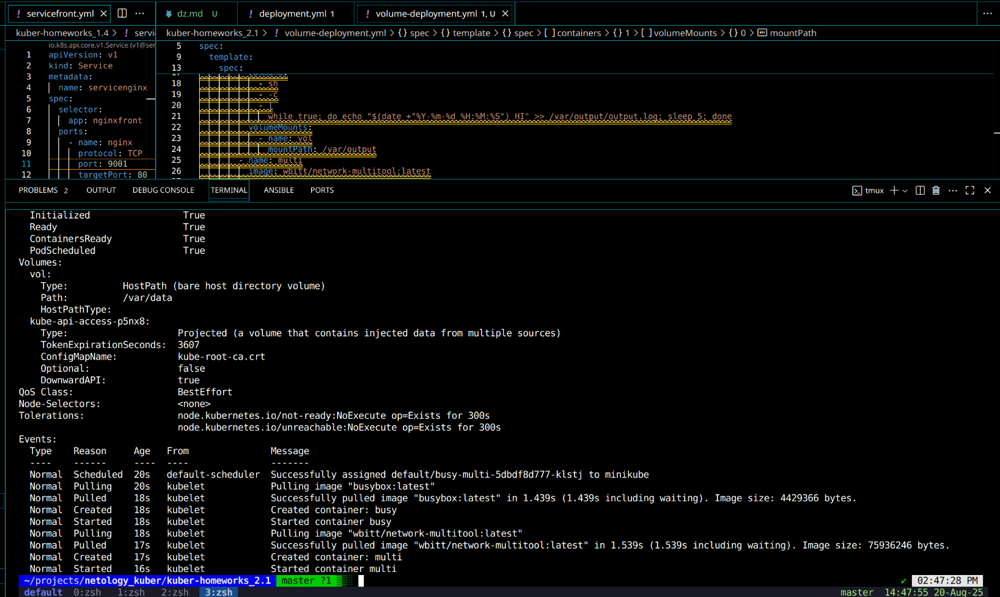
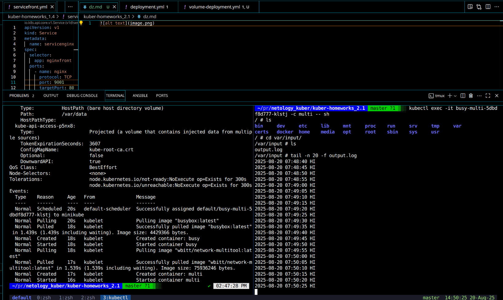
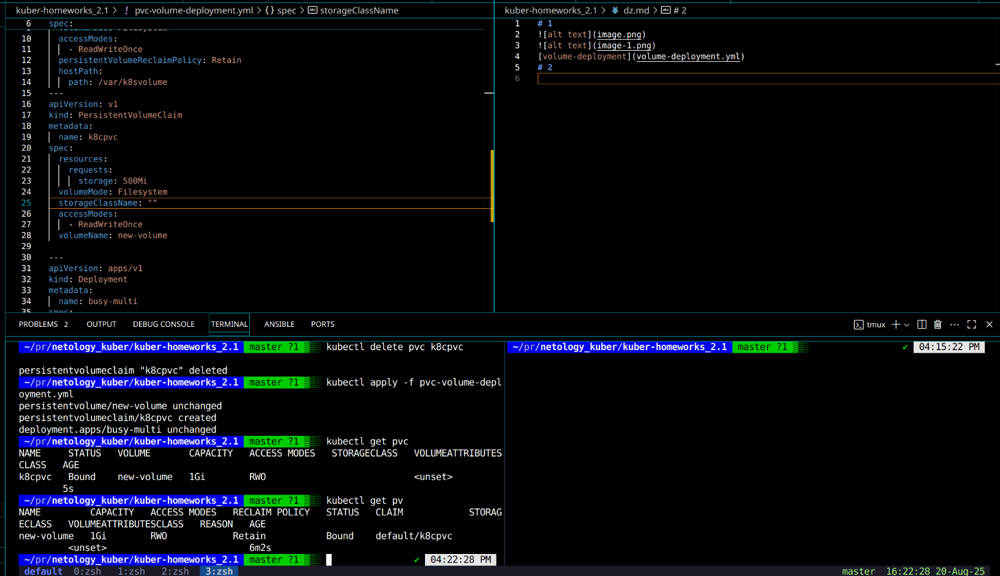
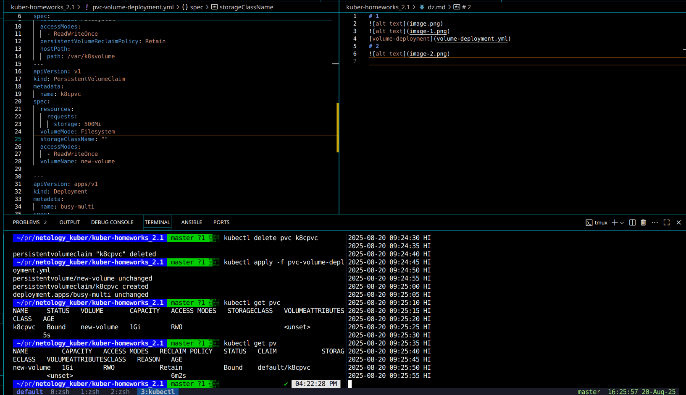
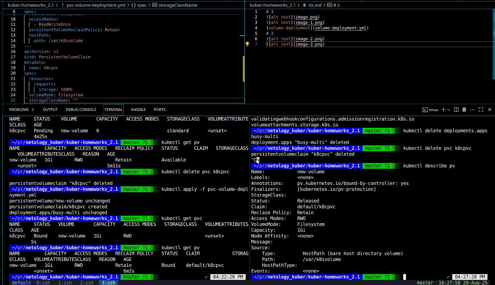
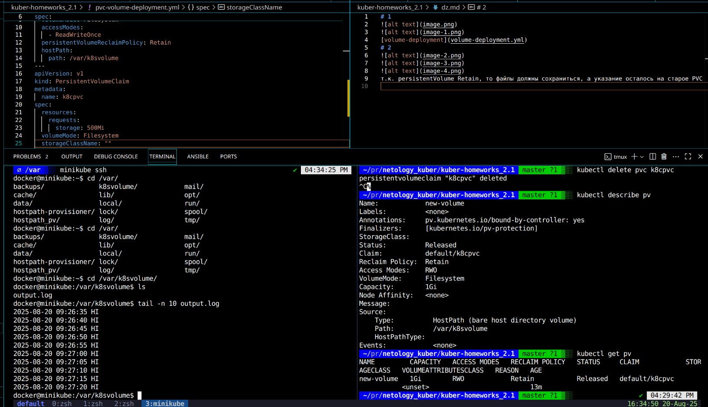
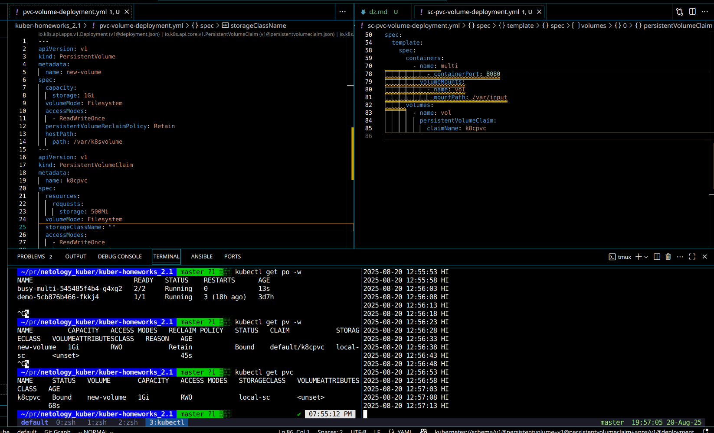

# 1

[volume-deployment](volume-deployment.yml)
# 2

т.к. persistentVolume Retain, то файлы должны сохраниться, а указание осталось на старое PVC

файл после удаления сущности pv остался, т.к. походу мы удалили только сущность и видимо, она за собой не чистит сторедж при удалении, верно?
[pvc-volume-deployment.yml](pvc-volume-deployment.yml)

# 3

[sc-pvc-volume-deployment](sc-pvc-volume-deployment.yml)