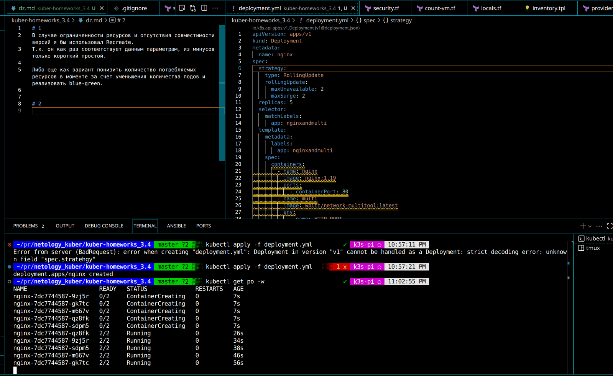
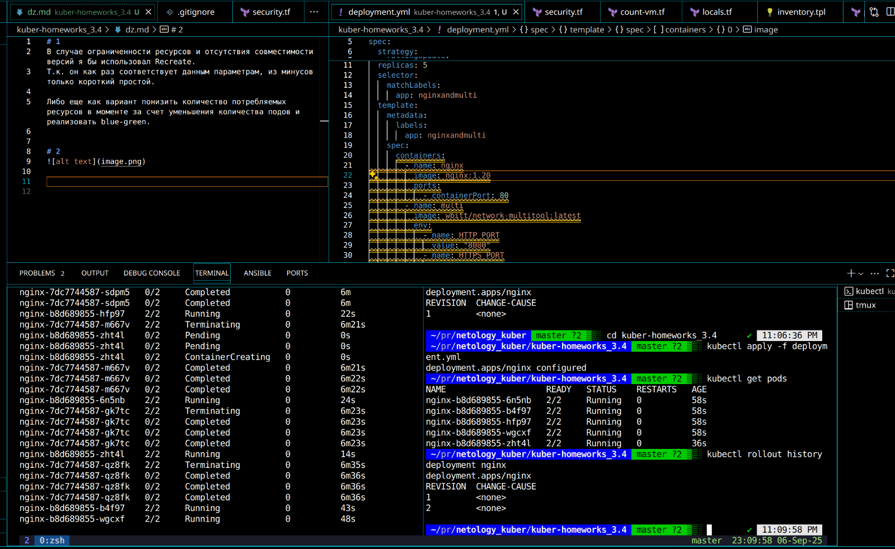
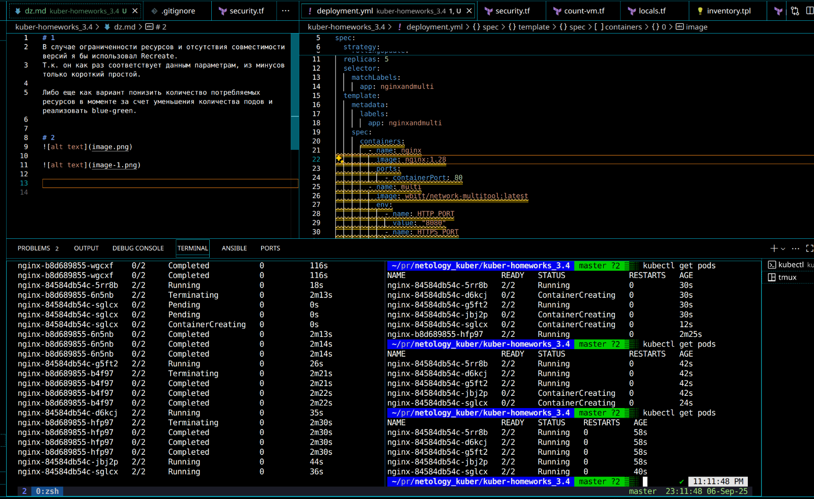
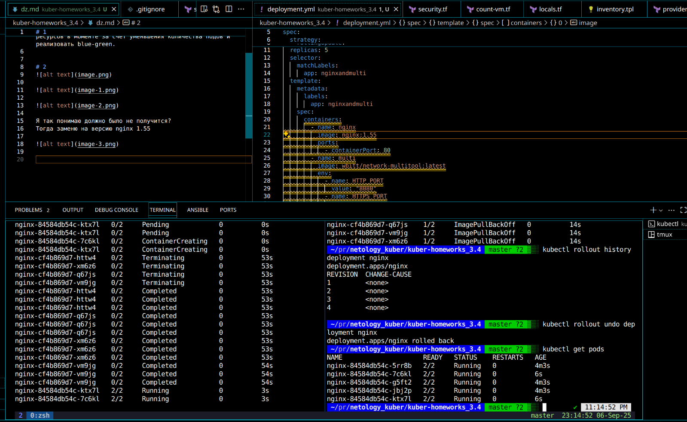

# 1
В случае ограниченности ресурсов и отсутствия совместимости версий я бы использовал Recreate.
Т.к. он как раз соответствует данным параметрам, из минусов только короткий простой.

Либо еще как вариант понизить количество потребляемых ресурсов в моменте за счет уменьшения количества подов и реализовать blue-green.

# 2

Я так понимаю должно было не получится?
Тогда заменю на версию nginx 1.55

