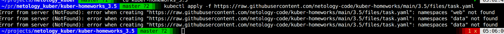
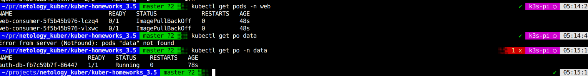
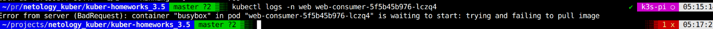
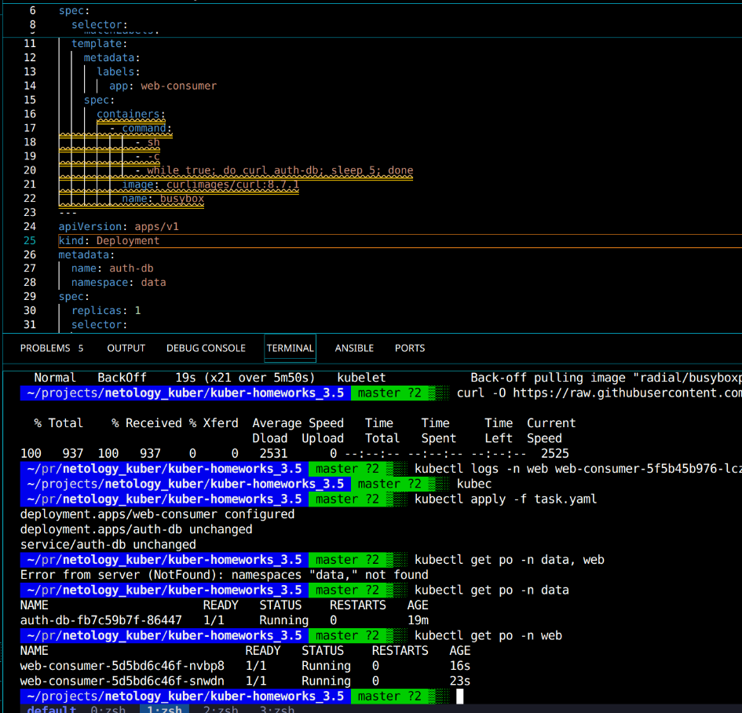

 
Проблема: Отсутствовали ns web, data.  
Решение: Добавил необходимые ns.  

Проблема:Под падает при ошибке скачивания образа.

Cмотрим ивенты в поде, вывод: используется старая схема.  
Можно либо заменить на более новый имедж, либо установить переменную 
`CONTAINERD_ENABLE_DEPRECATED_PULL_SCHEMA_1_IMAGE=1.

Заменил старый образ на новый, ноды успешно запустились.  

